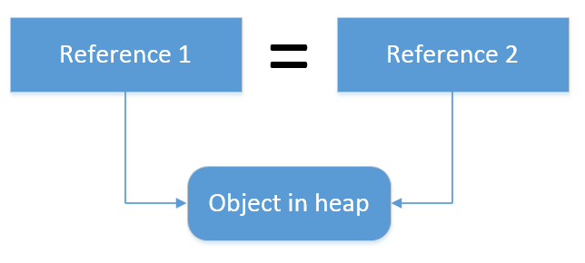
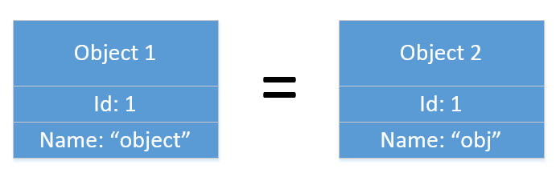
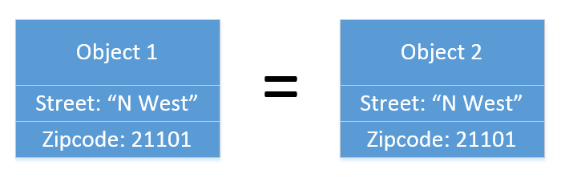

## Value Objects, Microtypes und das Specification Pattern
#### (die oft unterschaetzten Bausteine von DDD*)

Patrick Drechsler


### No Bashing!

Wer schreibt Code?

Wer sitzt in Meetings?


### Inhalt

- Value Objects: Was ist das - und warum braucht man das?
- Microtypes: Was ist das?
- Persistenz: "...aber mein Framework (zB ORM) mag keine Objekte ohne Id", und "was mache ich mit Collections?"
- Specification Pattern: Validierung im Kontext einer Entitaet


...kurzer Ausflug C# vs Java...

(no Java-Bashing, I promise)


```java
// Java
public class Customer {

    private string name;

    public void setName(string value) {
        this.name = value;
    }

    public string getName() {
        return this.name;
    }
}
```

```csharp
// C#
public class Customer 
{
    public string Name { get; set; }
}
```


```java
// Java
public class Customer {

    private string name;    

    public Customer(string name) { this.name = name; }

    public string getName() { return this.name; }
}
```

```csharp
// C#
public class Customer 
{
    public Customer(string name) { this.Name = name; }

    public string Name { get; }
}
```


#### Was ist eine Entity?

- Id <!-- .element: class="fragment" data-fragment-index="1" -->
- Lebenszyklus<!-- .element: class="fragment" data-fragment-index="1" -->


#### Was ist ein Value Object?

- Objekt ohne Id (immutable)
- hat attributbasierte Vergleichbarkeit
- ist oft "Cohesive" (verbindet z.B. Wert und Einheit)


#### Wie erkennt man Value Objects?


...hat wahrscheinlich jeder schon mal gesehen:
```csharp
public class Customer
{
    public int Id { get; set; } // evtl. in einer Entity-BaseClass 
    //...
    public string EMailAddress { get; set; }
}
```
Probleme: <!-- .element: class="fragment" data-fragment-index="1" -->
- Datentyp 'string' passt nicht wirklich zu EMail Adresse. <!-- .element: class="fragment" data-fragment-index="1" -->
- EMailAddress hat einen public setter. <!-- .element: class="fragment" data-fragment-index="1" -->


```csharp
public class Customer 
{
    //...
    public EMailAddress EMailAddress { get; private set; }
}
```

```csharp
public class EMailAddress 
{
    public EMailAddress(string value)
    {
        if (!IsValidEmailAddress(value)) 
            throw new MyInvalidEMailAddressException(value);
    }

    private bool IsValidEmailAddress(string value)
    {
        try 
        {
            new System.Net.Mail.MailAddress(value).Address = value;
        }
        catch { return false; }
    }
}
```
Mail Adresse ist immer gueltig <!-- .element: class="fragment" data-fragment-index="1" -->
<!-- Das klaert nicht die Frage, ob eine Email fuer den Customer verpflichtend ist (dazu spaeter mehr beim Specification Pattern) -->


Ist das eine gueltige EMail?

foo@bar


oder das?

localhost@patrick


```txt
[a-z0-9!#$%&'*+/=?^_`{|}~-]+(?:\.[a-z0-9!#$%&'*+/=?^_
`{|}~-]+)*@(?:[a-z0-9](?:[a-z0-9-]*[a-z0-9])?\.)+[a-z0-9]
(?:[a-z0-9-]*[a-z0-9])?
```


### Vergleichbarkeit ist attributbasiert


Exkurs Vergleichbarkeit


Equality by reference

http://enterprisecraftsmanship.com/2016/01/11/entity-vs-value-object-the-ultimate-list-of-differences/


Equality by identifier

http://enterprisecraftsmanship.com/2016/01/11/entity-vs-value-object-the-ultimate-list-of-differences/


Equality by structure

http://enterprisecraftsmanship.com/2016/01/11/entity-vs-value-object-the-ultimate-list-of-differences/


```csharp
public abstract class ValueObject<T> where T : ValueObject<T> {
    
    protected abstract IEnumerable<object> 
        GetAttributesToIncludeInEqualityCheck();

    public override bool Equals(object other) {
        return Equals(other as T);
    }

    public bool Equals(T other) {
        if (other == null) { return false }
        return GetAttributesToIncludeInEqualityCheck().
            .SequenceEqual(other.GetAttributesToIncludeInEqualityCheck());
    }

    public static bool operator ==(ValueObject<T> left, ValueObject<T> right) {
        return Equals(left, right);
    }

    public static bool operator !=(ValueObject<T> left, ValueObject<T> right) {
        return !(left == right);
    }

    public override int GetHashCode() {
        int hash = 17;
        foreach (var obj in this.GetAttributesToIncludeInEqualityCheck())
            hash = hash * 31 + (obj == null ? 0 : obj.GetHashCode());
        
        return hash;
    }
}
```


```csharp
public class EMailAddress : ValueObject<EMAilAddress> 
{
    public EMailAddress(string value) 
    { 
        if (!IsValidEmailAddress(value)) { /* throw */ }
        Value = value;
    }
    
    public string Value { get; }
    
    public override IEnumerable<object> 
        GetAttributesToIncludeInEqualityCheck() 
    {
        return new object[] { Value };
    }
```


### Fazit: Vergleichbarkeit fuer Value Objects

Man ueberschreibt die `Equals` und `GetHashCode` Methoden, damit nur die Attribute (aka Properties) verglichen werden.


### Microtypes
Fun fact: Als ich den Vortrag eingereicht habe, war mein Verstaendnis von Microtypes komplett falsch. 

Darum sind Vortraege sind gut!


### Microtypes

Mit Microtypes sind nicht etwa kleinere Einheiten von Value Objects gemeint (dachte ich auch urspruenglich).


### Microtypes
- Ein Microtype ist eine **Erweiterung** eines bestehenden Value Objects. 
- Aber nicht durch Ableitung, sondern durch Injection:

```csharp
public class InternalEMailAddress 
    : ValueObject<InternalEMailAddress> {

    // ctor
    public InternalEMailAddress(EMAilAddress value) {
        
        if (!IsInternalEMailAddress(value)) { /* throw */ }
        
        Value = value;
    }
}
```


*"Using microtypes is far from an industry standard. In fact, it's quite divisive. Some claim micro types are a precursor to clearer, more composable code, but for others, micro types are too many layers of annoying indirection. It's up to you to decide if you want to use the micro types pattern."*

Scott Millet/Mick Tune in Patterns, Principles and Practices of Domain-Driven Design


### Frameworks und Value Objects


- Value Objects sollten immutable sein.
- Problem: Wenn Domaenen Objekte 1-zu-1 mit einem ORM gemapped werden.
    - ORM braucht einen Proxy der Klasse
        - Jedes Attribut muss einen public setter haben


Muss der setter fuer das Attribut wirklich `public` sein? Langt nicht `internal` oder `protected`?


Kann man die Klasse als Value Object beim ORM registrieren?

Ja


Bsp Entity Framework (`ComplexType`)

```csharp
public class MyDbContext
{
    protected override void OnModelCreating(DbModelBuilder mb) 
    {
        mb.ComplexType<EMailAddress>();
    }
}   
 ```


Alternative: ORM nicht verwenden


#### Wie speichert man Listen von Value Objects?
string: JSON, XML, ...


### Specification Pattern

Zurueck zu Entitaeten... 


Also zB dem Customer Objekt

```csharp
public class Customer {
    public int Id { get; set; }
    public EMailAddress EMailAddress { get; set; }
}
```


- EMail ist ein Pflichtfeld ☑
- Wie waers mit einer **IsValid** Methode?
```csharp
public class Customer {
    //..
    public bool IsValid() {
        return EMAilAddress != null;
    }
}
```
